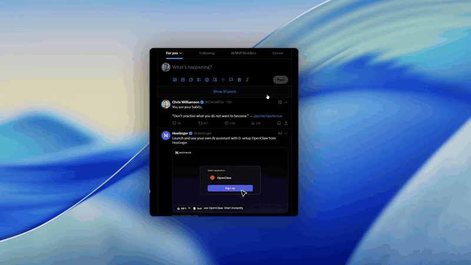

# open-transcribe

A Chrome extension + self-hosted FastAPI backend that adds **📥 MP3** and **📝 Text** buttons next to videos on x.com, twitter.com, and youtube.com (watch pages, Shorts, and feed thumbnails). Click to download the audio, or get an instant Whisper transcript. Multi-user via Google sign-in. Per-user transcript history.

Built as a personal-utility weekend project. Open-sourced under MIT — fork it, run it, change the platforms, do whatever.

## Demo



<sub>(Higher quality with audio: [open the MP4 directly](./Demo.mp4).)</sub>

## Architecture

```
┌──────────────────┐     ┌────────────────────┐     ┌──────────────────┐
│  Chrome on x.com │ ──▶ │   ngrok HTTPS URL  │ ──▶ │ FastAPI on VPS   │
│  (extension)     │     │   (free tunnel)    │     │ port 8765        │
└──────────────────┘     └────────────────────┘     └────────┬─────────┘
                                                             │
                                              ┌──────────────┼──────────────┐
                                              ▼              ▼              ▼
                                        yt-dlp ─▶ ffmpeg   Groq Whisper   SQLite
                                        (video → MP3)      (audio → text) (users + history)
```

## Highlights

- **Self-host with your own keys.** No central service operated by anyone. You provide a Groq API key (free tier is plenty), you run the backend, your transcripts live in your SQLite.
- **Multi-user.** Google sign-in lets you give access to family/team without sharing API keys.
- **Cached.** Re-clicking on a previously transcribed video returns the saved transcript in ~25 ms — no re-download, no Groq call.
- **Multi-platform.** Built-in: x.com / twitter.com and youtube.com (watch pages, Shorts, thumbnails). yt-dlp supports 1000+ sites — adding more is whitelisting domains in `extension/manifest.json` and writing a small per-platform adapter in `extension/content.js`.
- **Tiny footprint.** Runs on a 1 vCPU / 1 GB RAM VPS. No GPU. Whisper happens in Groq's cloud.

## Quick start

For the full step-by-step guide (with troubleshooting), see [SETUP.md](./SETUP.md). The short version:

```bash
# On your VPS
sudo apt install -y ffmpeg
git clone https://github.com/contactkvijay/open-transcribe.git
cd open-transcribe/backend
python3 -m venv venv
./venv/bin/pip install -r requirements.txt
cp .env.example .env
# edit .env: GOOGLE_CLIENT_ID, GROQ_API_KEY, JWT_SECRET (openssl rand -hex 32)
./venv/bin/uvicorn main:app --host 0.0.0.0 --port 8765
```

Then in another terminal:

```bash
ngrok http 8765
# copy the https://*.ngrok-free.app URL
```

On your desktop:

1. Open `chrome://extensions/`, enable Developer mode, click **Load unpacked** → select the `extension/` folder.
2. Copy the extension ID, paste it into your Google OAuth client's authorized redirect URIs as `https://<EXT_ID>.chromiumapp.org/`.
3. Open the extension's options page → paste your ngrok URL and Google Client ID → Save.
4. Click the extension icon → Sign in with Google.
5. Visit any X post with a video, or any YouTube watch page / Short / video thumbnail → see the 📥 MP3 and 📝 Text buttons appear.

If you've never wired Google OAuth before, the [SETUP.md](./SETUP.md) walks through the Google Cloud Console steps screen-by-screen.

## Project layout

```
open-transcribe/
├── backend/        FastAPI app
│   ├── main.py     entry, health, scheduler
│   ├── auth.py     Google id_token verify + JWT
│   ├── ytdl.py     yt-dlp wrapper (video → MP3)
│   ├── transcribe.py  Groq Whisper wrapper
│   ├── routers/    /api/auth/google, /api/transcribe, /api/history
│   ├── models.py   User + Transcript ORM
│   └── .env.example
├── extension/      Chrome MV3 (load unpacked)
│   ├── manifest.json
│   ├── background.js  service worker, OAuth flow
│   ├── content.js     button injection on x.com
│   ├── popup.*        sign-in + history list
│   └── options.*      backend URL + client ID
├── LICENSE         MIT
├── README.md       you are here
└── SETUP.md        full setup walkthrough
```

## Endpoints

| Method | Path | Auth |
|---|---|---|
| `POST` | `/api/auth/google` — body `{id_token}` | none |
| `GET` | `/api/me` | bearer |
| `POST` | `/api/transcribe` — body `{url, mode: "text"\|"audio"\|"both"}` | bearer |
| `GET` | `/api/history?limit=&offset=` | bearer |
| `GET` | `/api/history/{id}` | bearer |
| `DELETE` | `/api/history/{id}` | bearer |
| `GET` | `/api/audio/{token}` (HMAC short-lived URL) | none — token is auth |
| `GET` | `/health` | none |

## Configuration

All config is in `backend/.env` (copy from `.env.example`). Key vars:

| Var | What it does |
|---|---|
| `GOOGLE_CLIENT_ID` | OAuth Web Application client ID (see SETUP.md Phase 5) |
| `GROQ_API_KEY` | Groq Whisper key — free tier works fine |
| `GROQ_MODEL` | Default `whisper-large-v3-turbo`. Other Groq Whisper models also supported. |
| `JWT_SECRET` | Random 32-byte hex (`openssl rand -hex 32`). Used for session JWTs and signed audio URLs. |
| `AUDIO_RETENTION_HOURS` | How long downloaded MP3s stay on disk before the cleanup job purges them. Default 24. |
| `ALLOWED_ORIGINS` | CORS allowlist. `chrome-extension://*` lets any unpacked extension hit it. |
| `YTDL_COOKIES_PATH` | Optional absolute path to a yt-dlp `cookies.txt`. Required for age-gated and members-only YouTube videos. |

## YouTube setup (required for most videos)

In practice YouTube needs **three** things stacked or transcription fails. The backend handles #3 automatically; you have to set up #1 and #2 once.

### 1. Cookies (`cookies.txt`)

YouTube's anti-bot heuristics flag yt-dlp running on a VPS even on public videos, returning *"Sign in to confirm you're not a bot"*. Authenticated cookies bypass that. **Use a burner Google account** — a `cookies.txt` is a full session token.

The export procedure has to be followed strictly or YouTube rotates the tokens and invalidates the file you just saved:

1. Quit Chrome entirely first. No tab, anywhere, on YouTube.
2. Open a **fresh Incognito window** and sign in to YouTube with the burner account.
3. Open *one* YouTube tab, confirm a video plays. Don't navigate further.
4. Install [**Get cookies.txt LOCALLY**](https://chromewebstore.google.com/detail/get-cookiestxt-locally/cclelndahbckbenkjhflpdbgdldlbecc) → click the extension → URL filter `youtube.com` → format **Netscape** → **Export**.
5. **Within seconds**: close the *entire* Incognito window (not just the tab).
6. SCP the file to the VPS:
   ```bash
   scp youtube.com_cookies.txt vijay@vps:/opt/transcribe/backend/data/cookies.txt
   chmod 600 /opt/transcribe/backend/data/cookies.txt
   ```
7. In `backend/.env`:
   ```
   YTDL_COOKIES_PATH=/opt/transcribe/backend/data/cookies.txt
   ```
8. Restart FastAPI.

Cookies expire in a few weeks; when transcription fails again with the bot message, repeat the export. File path doesn't change.

### 2. Deno (JS runtime)

YouTube uses an "n parameter" challenge that needs JS evaluation to decrypt the audio format URL. Without a JS runtime, yt-dlp can extract metadata but only thumbnail images — you'll see *"Requested format is not available"*.

Install deno once:

```bash
curl -fsSL https://deno.land/install.sh | sudo DENO_INSTALL=/usr/local sh
deno --version  # confirm it's on PATH
```

### 3. Challenge solver script (handled by the backend)

`backend/ytdl.py` passes `remote_components=["ejs:github"]` to yt-dlp, which downloads the n-challenge solver from yt-dlp's GitHub on first use and caches it. No user action needed — listing it here so you know what the warning is about if you ever see it surface.

## Disclaimer

This is a **personal-use, self-hosted tool** — you run the backend, you provide your own API keys, your transcripts stay on your server. Nothing is hosted by the maintainer.

Users are responsible for complying with the Terms of Service of any site they extract content from. Don't redistribute downloaded videos. Don't run this as a public service for other people without checking the relevant legalities for your jurisdiction.

## License

MIT — see [LICENSE](./LICENSE). Use it however you want; don't sue me if it breaks.

## Credits

Built on the shoulders of [yt-dlp](https://github.com/yt-dlp/yt-dlp), [Groq Whisper](https://groq.com/), [FastAPI](https://fastapi.tiangolo.com/), and Chrome's [`identity.launchWebAuthFlow`](https://developer.chrome.com/docs/extensions/reference/api/identity).
